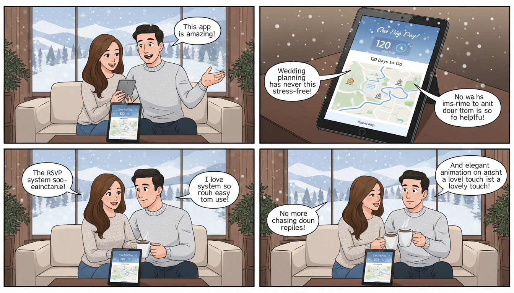

# Arán Amor - Cuenta Atrás 🏔️❤️

A beautiful, interactive wedding invitation and countdown application designed for a special celebration in the Arán Valley. This project features a responsive design, elegant animations, and essential event information.

## 📖 Overview

**Arán Amor** is a dedicated landing page for a wedding or event, likely set in the scenic Val d'Arán. It serves as a digital hub for guests to track the time remaining until the big day, explore event locations (the Church and the Reception), RSVP, and view the gift registry.

The application features a "winter/mountain" aesthetic, complete with a snowfall effect, vintage image frames, and smooth scroll reveals.

## ✨ Features

-   **Interactive Countdown:** Real-time countdown timer to the event date.
-   **Atmospheric Snowfall:** A custom React-based snowfall animation to set the mountain mood.
-   **RSVP System:** Integrated form for guests to confirm attendance.
-   **Location Details:** Dedicated sections for the ceremony (Church) and the celebration (Parador), featuring maps and imagery.
-   **Gift List:** A structured section for registry information.
-   **Responsive Design:** Fully optimized for mobile, tablet, and desktop views.
-   **Vintage Aesthetics:** Custom image frames and "Reveal" animations for a premium feel.

## 🛠️ Tech Stack

-   **Framework:** [React 18](https://reactjs.org/)
-   **Build Tool:** [Vite](https://vitejs.dev/)
-   **Language:** [TypeScript](https://www.typescriptlang.org/)
-   **Styling:** [Tailwind CSS](https://tailwindcss.com/)
-   **UI Components:** [shadcn/ui](https://ui.shadcn.com/) (based on Radix UI)
-   **Animations:** CSS Transitions & custom components
-   **Icons:** [Lucide React](https://lucide.dev/)

## 🚀 Getting Started

### Prerequisites

-   Node.js (v18.0.0 or higher)
-   npm or bun

### Installation

1.  **Clone the repository:**
    ```bash
    git clone https://github.com/your-username/aran-amor-cuenta-atras.git
    cd aran-amor-cuenta-atras
    ```

2.  **Install dependencies:**
    ```bash
    npm install
    # or
    bun install
    ```

3.  **Start the development server:**
    ```bash
    npm run dev
    ```

4.  **Build for production:**
    ```bash
    npm run build
    ```

## 📂 Project Structure

```text
src/
├── components/
│   ├── ui/                # Reusable shadcn components (buttons, cards, etc.)
│   ├── sections/          # Major page sections (Hero, RSVP, Church, etc.)
│   ├── CountdownTimer.tsx # The countdown logic
│   ├── Snowfall.tsx       # Visual snow effect
│   └── ImageReveal.tsx    # Scroll-triggered image animations
├── pages/
│   ├── Index.tsx          # Main landing page
│   └── NotFound.tsx       # 404 Error page
├── App.tsx                # Main application routing and providers
└── main.tsx               # Entry point
```

## 💻 Code Examples

### Countdown Component Usage
The `CountdownTimer` is a core feature that calculates the time remaining until the event.

```tsx
// Example usage in a section
import { CountdownTimer } from "@/components/CountdownTimer";

const HeroSection = () => {
  const targetDate = new Date("2025-09-20T12:00:00");

  return (
    <section>
      <h1>¡Nos casamos!</h1>
      <CountdownTimer targetDate={targetDate} />
    </section>
  );
};
```

### Snowfall Effect
The mountain atmosphere is enhanced by a snowfall overlay that can be toggled or customized.

```tsx
import { Snowfall } from "./components/Snowfall";

function App() {
  return (
    <div className="relative">
      <Snowfall />
      <main>{/* Content */}</main>
    </div>
  );
}
```

## 🎨 Customization

### Changing Images
Place your event images in `public/img/`. Update the source paths in the respective section components:
- `ChurchSection.tsx`
- `ReceptionSection.tsx`
- `HeroSection.tsx`

### Updating Event Details
Most text content and dates can be found in `src/pages/Index.tsx` and the components inside `src/components/sections/`.

## 🌐 Deployment

The project is configured for easy deployment via platforms like **Vercel**, **Netlify**, or **Cloudflare Pages**. 

If using the Lovable platform:
1. Open your project in [Lovable](https://lovable.dev/).
2. Click **Share** -> **Publish**.

## 📄 License

This project is private and intended for personal use for the Arán Amor event celebration.

---

*Made with ❤️ for a special day in the Arán Valley.*